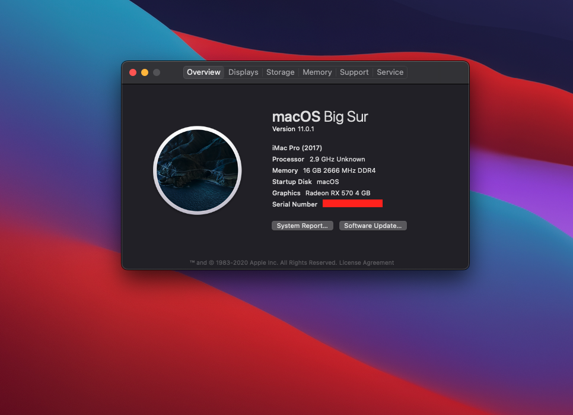

# Opencore 0.6.3

Please generate SMBIOS !!!

### 🔍 Specifications

| Specifications     | Detail                                      |
| ------------------ | ------------------------------------------- |
| Mother Board model | GIGABYTE B365 M AORUS ELITE                 |
| Processor          | INTEL 1151 CORE I5-9400F 2.90 GHz           |
| Memory             | TOUGHRAM Z-ONE RGB Memory DDR4 3200MHz 16GB |
| Graphics Card      | AORUS Radeon™ RX570 4G                      |
